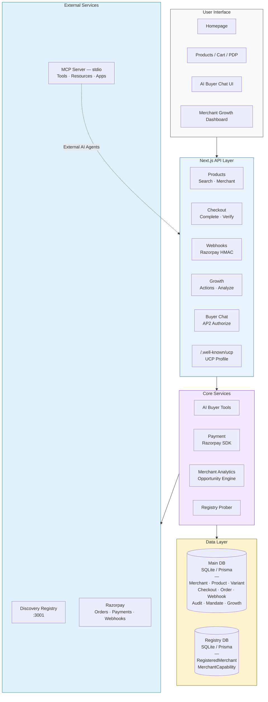

<p align="center">
  <h1 align="center">Agentic Commerce</h1>
  <p align="center">
    <strong>AI-native merchant interoperability platform for autonomous shopping</strong>
  </p>
</p>

---

## Table of Contents

- [Project Overview](#project-overview)
- [Problem Statement](#problem-statement)
- [Solution](#solution)
- [How the Agentic Commerce Flow Works](#how-the-agentic-commerce-flow-works)
- [Key Features](#key-features)
  - [AI Buyer](#ai-buyer)
  - [Multi-Merchant Marketplace](#multi-merchant-marketplace)
  - [Product Discovery & Best-Match Ranking](#product-discovery--best-match-ranking)
  - [AI Negotiation](#ai-negotiation)
  - [UCP Checkout](#ucp-checkout)
  - [AP2 Authorization](#ap2-authorization)
  - [Razorpay Payments](#razorpay-payments)
  - [MCP Server](#mcp-server)
  - [MCP Apps](#mcp-apps)
  - [Merchant Growth Agent](#merchant-growth-agent)
- [System Architecture](#system-architecture)
- [Security & Payment Authority Boundaries](#security--payment-authority-boundaries)
- [Tech Stack](#tech-stack)
- [Local Setup](#local-setup)
- [Environment Variables](#environment-variables)
- [AI Provider Configuration](#ai-provider-configuration)
- [Testing & Verification](#testing--verification)
- [External Agent / MCP Usage](#external-agent--mcp-usage)
- [Known Limitations](#known-limitations)
- [Future Scope](#future-scope)
- [License](#license)

---

## Project Overview

**Agentic Commerce** is a full-stack AI-native marketplace platform built for the **Razorpay Buildathon Track One**. It demonstrates how AI agents can autonomously discover merchants, search products, negotiate prices, create checkouts, obtain cryptographic human authorization, and complete real payments through Razorpay — all within strict trust boundaries that prevent the AI from unilaterally spending money.

The platform has two operational sides:

1. **AI Commerce Side** — An AI Buyer agent discovers merchants across a multi-merchant marketplace, selects the best-match products, creates UCP checkout sessions, requests explicit human authorization via AP2, and processes payments through Razorpay.
2. **Merchant Growth Side** — A Merchant Growth Agent analyzes sales data, identifies cross-sell/upsell opportunities, proposes bounded pricing actions, and measures outcomes — all gated behind merchant approval.

Both sides are connected: the AI Commerce side generates real transaction data that feeds into the Merchant Growth side's analytics engine, creating a closed-loop AI commerce ecosystem.

---

## Problem Statement

Traditional ecommerce is designed for human interaction. A customer discovers a merchant through search engines, navigates the website, browses products, and manually completes checkout. This model breaks when an AI agent enters the picture:

> *"Find me good running shoes under ₹5,000 that can be delivered quickly."*

There is no standardized way for AI agents to:

- **Discover** which merchants exist and what they sell
- **Understand** merchant capabilities, policies, and product catalogs programmatically
- **Negotiate** pricing within safe boundaries
- **Authorize** payments without bypassing human consent
- **Transact** with end-to-end cryptographic integrity

Without these building blocks, AI commerce is either impossible or dangerously unconstrained.

---

## Solution

Agentic Commerce solves this by building an end-to-end agentic shopping pipeline:

| Layer | What It Does |
|---|---|
| **Discovery Registry** | AI agents query a central registry to find merchants by category |
| **UCP Profiles** | Each merchant exposes a `/.well-known/ucp` endpoint describing its capabilities |
| **Product Catalog APIs** | Structured JSON APIs for machine-readable product search and retrieval |
| **AI Buyer Agent** | Gemini-powered agent that orchestrates the entire flow via tool calls |
| **UCP Checkout** | Standardized checkout session creation and management |
| **AP2 Authorization** | Ed25519-signed, amount-bound, time-limited mandates requiring human confirmation |
| **Razorpay Payments** | Real payment processing through Razorpay (test mode) with webhook verification |
| **MCP Server** | Model Context Protocol server enabling any MCP-compatible AI to use the marketplace |
| **Merchant Growth Agent** | AI-driven analytics and growth optimization with human-approval gates |

The key design principle: **the AI can propose, but only the human can authorize money movement**.

---

## How the Agentic Commerce Flow Works

```mermaid
flowchart TD
    A["User Request\n'Find me running shoes under ₹5,000'"]
    
    A --> B

    subgraph AI_BUYER ["AI Buyer Agent — Gemini"]
        B["Search Merchants"] -->|query| C["Discovery Registry\n(:3001)"]
        C -->|merchant domains| D["Fetch UCP Profile\n/.well-known/ucp"]
        D --> E["Search Product Catalog\n/api/products/search"]
        E -->|"AI ranks & selects best match"| F["Create Checkout\n/api/checkout"]
        F --> G["AP2 Capability Negotiation\nDetached JWS + JCS"]
    end

    G --> H

    subgraph HUMAN_GATE ["Human Confirmation Gate"]
        H["Authorization Required\nThe AI CANNOT skip this"]
    end

    H -->|"User clicks Authorize & Pay"| I

    subgraph AP2 ["AP2 Authorization"]
        I["Generate Ed25519 Mandate\namount-bound · time-limited"]
        I --> J["Checkout Completion\n/api/checkout/:id/complete"]
        J --> K["Verify Mandate\nsignature · binding · expiry"]
        K --> L["Atomic Consumption\nno double-spend"]
    end

    L --> M

    subgraph PAYMENT ["Razorpay Payment"]
        M["Create Razorpay Order"] --> N["Razorpay Checkout\nTest Mode"]
        N --> O["Webhook Verification\n/api/webhooks/razorpay"]
        O --> P["HMAC · Idempotency · Amount Check"]
    end

    P --> Q["Order Confirmed\nAudit Trail"]

    style A fill:#f0f0f0,stroke:#333,stroke-width:2px,color:#111
    style H fill:#fff3cd,stroke:#856404,stroke-width:2px,color:#856404
    style Q fill:#d4edda,stroke:#155724,stroke-width:2px,color:#155724
    style AI_BUYER fill:#e8f4fd,stroke:#0d6efd,stroke-width:1px
    style HUMAN_GATE fill:#fff8e1,stroke:#f59e0b,stroke-width:2px
    style AP2 fill:#f3e8ff,stroke:#7c3aed,stroke-width:1px
    style PAYMENT fill:#e0f2fe,stroke:#0284c7,stroke-width:1px
```



---

## Key Features

### AI Buyer

The AI Buyer is a conversational agent powered by Google Gemini that acts as a personal shopping assistant. Users describe what they need in natural language, and the agent:

- Searches the discovery registry for relevant merchants
- Reads each merchant's UCP profile to understand capabilities
- Queries product catalogs across multiple merchants
- Ranks and selects the best-match product based on user criteria (price, category, availability)
- Creates a UCP checkout session
- Presents a human confirmation gate with full transaction details
- Completes payment through Razorpay after explicit human authorization

The agent communicates progress via Server-Sent Events (SSE), providing real-time status updates in a chat-like interface with a 4-step progress stepper: **Discover → Checkout → Authorize → Complete**.

### Multi-Merchant Marketplace

The platform operates as a true multi-merchant marketplace, not a single-store demo:

- **Multiple merchants** are registered (Aster Gear, Omega Sports) with distinct product catalogs
- A **Discovery Registry** (standalone service on port 3001) indexes merchants by category
- Each merchant maintains its own product database, pricing, and policies
- The AI Buyer can search across all registered merchants and select the best option
- A **Network Catalog** on the homepage showcases products from all merchants with merchant badges

### Product Discovery & Best-Match Ranking

The AI agent doesn't just return the first result — it actively ranks products:

- Full-text search across product names, descriptions, brands, and categories
- Filter by category, price range, availability, and attributes
- AI-powered best-match selection considering user constraints (budget, use case, size)
- Structured product data with variants (size, color), inventory levels, and shipping info
- Related, alternative, and complementary product recommendations

### AI Negotiation

The platform supports AI-driven price negotiation within safe boundaries:

- The AI Buyer can request discounts via the `negotiate_discount` tool
- Negotiation is bounded by server-enforced merchant policies (max 20% discount)
- The server calculates `minAllowedPrice = originalPrice × 0.80` and rejects requests exceeding this
- Negotiation results are applied to the checkout session
- All negotiations are audited

### UCP Checkout

Checkout follows the Unified Commerce Protocol (UCP) standard:

- `/.well-known/ucp` — Machine-readable merchant capability profile
- `POST /api/checkout` — Create a new checkout session with line items
- `GET /api/checkout/:id` — Retrieve current checkout state
- `PATCH /api/checkout/:id` — Update shipping address and buyer info
- `POST /api/checkout/:id/complete` — Complete checkout with AP2 mandate
- Sessions have a 30-minute expiry window
- Idempotent completion (returning existing order if already processed)

### AP2 Authorization

Agent Protocol 2 (AP2) provides cryptographic payment authorization:

- **Ed25519 key pair** generated per authorization request
- **Mandate** is cryptographically bound to: amount, currency, merchant ID, checkout ID, and expiry time
- **Signature** computed over the canonicalized (JCS/RFC 8785) mandate payload
- **Human confirmation gate** — The user must explicitly click "Authorize & Pay" in the browser UI
- **Checkout mutation detection** — If the checkout changes after authorization, the mandate is automatically revoked
- **Atomic consumption** — `updateMany` with `status: 'ACTIVE'` guard prevents double-spending via concurrent requests
- **Time-limited** — Mandates expire after 15 minutes

### Razorpay Payments

Real payment processing through Razorpay (test mode):

- **Razorpay Order** created server-side after AP2 mandate verification
- **Razorpay Checkout.js** loaded dynamically in the browser for payment
- **Webhook handler** (`/api/webhooks/razorpay`) for payment status updates
- **HMAC verification** of webhook signatures using `RAZORPAY_KEY_SECRET`
- **Idempotent webhook processing** via `x-razorpay-event-id` deduplication
- **Amount/currency validation** — Webhook amount is compared against the order total
- **Atomic state transitions** — `$transaction` for order + checkout status updates

### MCP Server

A full Model Context Protocol (MCP) server enables any MCP-compatible AI to interact with the marketplace:

```bash
npm run mcp  # Starts the MCP server via stdio
```

**Registered Tools:**

| Tool | Description |
|---|---|
| `search_merchants` | Search the discovery registry by category/keyword |
| `get_merchant_profile` | Fetch a merchant's UCP profile |
| `search_products` | Search a merchant's product catalog |
| `get_product` | Get detailed product information |
| `create_checkout` | Initialize a checkout session |
| `get_checkout` | Retrieve checkout state |
| `update_checkout` | Update shipping/buyer info |
| `complete_checkout` | Complete checkout with optional AP2 mandate |
| `negotiate_discount` | Attempt AI-driven price negotiation |

### MCP Apps

The MCP server also exposes interactive **MCP Apps** resources for rich UI rendering:

- **Resource URI:** `ui://marketplace/checkout/{domain}/{checkoutId}`
- Provides structured JSON with `_meta.ui` metadata for MCP clients to render interactive checkout modals
- Includes `CheckoutModal` component reference with `complete_checkout` and `negotiate_discount` actions
- Falls back to text-based checkout summary for non-UI clients

### Merchant Growth Agent

The Merchant Growth Agent is an AI-powered analytics and optimization system for merchants:

**Analytics Engine** (`analytics.ts`):
- Revenue and order metrics
- Per-product sales performance
- Cross-sell pair detection from order data
- Low-performer identification

**Opportunity Engine** (`opportunity-engine.ts`):
- Cross-sell opportunity detection
- Low-performer discount recommendations
- Historical feedback adjustment (learns from past action outcomes)

**Growth Action Pipeline:**
1. AI proposes actions via `POST /api/growth/actions` (e.g., "Add cross-sell links", "Apply 10% discount")
2. Server validates constraints (max 20% discount, product existence, minimum price)
3. Merchant reviews in the **Growth Dashboard** (`/merchant/growth`)
4. Merchant approves via `POST /api/growth/actions/:id/approve`
5. Server re-validates and atomically executes
6. Measurement via `POST /api/growth/actions/measure` — tracks post-action sales and classifies outcomes (SUCCESS/NEUTRAL/NEGATIVE)

**Key Principle:** The AI cannot self-approve. All actions require explicit merchant approval through the dashboard UI.

---

## System Architecture



### Database Architecture

**Main Database** (`prisma/dev.db` — SQLite):

| Model | Purpose |
|---|---|
| `Merchant` | Merchant profile, configuration, and policies |
| `Product` | Product catalog with pricing, inventory, and attributes |
| `Variant` | Product variants (size, color, material) with per-variant pricing |
| `CheckoutSession` | UCP checkout sessions with status tracking |
| `CheckoutLineItem` | Individual items in a checkout |
| `Order` | Orders with Razorpay order/payment IDs |
| `WebhookEvent` | Webhook idempotency tracking |
| `AuditLog` | Full audit trail for all agent and system actions |
| `AuthorizationMandate` | AP2 bounded authorization mandates (Ed25519 signed) |
| `GrowthOpportunity` | AI-detected merchant growth opportunities |
| `GrowthAction` | Proposed, approved, and executed growth actions |

**Registry Database** (`prisma/registry.db` — SQLite):

| Model | Purpose |
|---|---|
| `RegisteredMerchant` | Merchants registered for AI discovery |
| `MerchantCapability` | Verified merchant capabilities (product_discovery, checkout) |

---

## Security & Payment Authority Boundaries

### AI Trust Boundaries

| Boundary | Enforcement |
|---|---|
| AI cannot set prices | Prices fetched from authoritative product database, never from AI input |
| AI cannot bypass human authorization | Checkout completion requires an active AP2 mandate (explicit user click) |
| AI cannot directly authorize payment | Authorization is a separate explicit user action in the browser |
| AI cannot substitute merchants | Merchant resolution is server-controlled via the discovery registry |
| AI cannot substitute checkouts | AP2 mandate is cryptographically bound to a specific checkout ID |
| AI cannot replay authorization | Mandates consumed atomically; CONSUMED mandates are rejected |
| AI Growth Agent cannot self-approve | Approval requires separate API call from merchant dashboard UI |
| AI cannot exceed discount limits | Server enforces max 20% discount at both proposal and execution time |

### Payment Security

| Control | Implementation |
|---|---|
| Razorpay HMAC webhook verification | `crypto.createHmac('sha256', secret)` |
| Webhook idempotency | `x-razorpay-event-id` unique constraint |
| Amount/currency validation | Webhook amount compared to order total |
| Atomic state transitions | `$transaction` for order + checkout updates |
| Mandate signature verification | Ed25519 `crypto.verify()` with JCS-canonicalized payload |
| Checkout mutation detection | If checkout changes post-authorization, mandate is revoked |

### SSRF Protection

The registry prober includes comprehensive SSRF protection:
- Protocol enforcement (only `http:` / `https:`)
- DNS resolution with private IP blocking (10.x, 172.16-31.x, 192.168.x, 169.254.x)
- Cloud metadata blocking (169.254.169.254)
- Redirect following with SSRF re-check (max 3 hops)
- 5-second timeout and 1MB response size limit

---

## Tech Stack

| Layer | Technology |
|---|---|
| Framework | Next.js 16 (App Router, React 19) |
| Language | TypeScript 5.9 |
| Database | SQLite via Prisma 6.12 (dual-schema: main + registry) |
| AI / LLM | Google Gemini (`@google/genai` SDK) |
| Payments | Razorpay SDK 2.9 (test mode) |
| MCP | `@modelcontextprotocol/sdk` 1.30 |
| Styling | Tailwind CSS 4 |
| State Management | Zustand 5 |
| Validation | Zod 4 |
| Cryptography | Node.js `crypto` (Ed25519 signatures) |
| Canonicalization | `canonicalize` (JCS — RFC 8785) |
| Testing | Playwright 1.62 + axe-core (accessibility) |
| Font | Inter (Google Fonts) |

---

## Local Setup

### Prerequisites

- **Node.js** ≥ 18
- **npm** ≥ 9

### Installation

```bash
# 1. Clone the repository
git clone https://github.com/<your-username>/agentic-commerce.git
cd agentic-commerce

# 2. Install dependencies
npm install

# 3. Generate Prisma clients (runs automatically via postinstall)
npx prisma generate
npx prisma generate --schema=prisma/registry.schema.prisma

# 4. Seed the database with sample merchants and products
npx prisma db push
npx prisma db push --schema=prisma/registry.schema.prisma
npx tsx prisma/seed.ts

# 5. Create .env file (see Environment Variables below)
cp .env.example .env

# 6. Start the development server
npm run dev

# 7. (Optional) Start the Discovery Registry in a separate terminal
node discovery-registry/server.js
```

The app will be running at **http://localhost:3000** and the Discovery Registry at **http://localhost:3001**.

### Quick Verification

```bash
# Check UCP profile
curl http://localhost:3000/.well-known/ucp

# Search products via API
curl "http://localhost:3000/api/products/search?q=running+shoes"

# Check Discovery Registry
curl "http://localhost:3001/api/discover?category=Running"
```

---

## Environment Variables

Create a `.env` file in the project root:

```env
# Razorpay Configuration
RAZORPAY_MODE=test
RAZORPAY_KEY_ID=rzp_test_XXXXXXXXXXXX
RAZORPAY_KEY_SECRET=your_razorpay_key_secret
NEXT_PUBLIC_RAZORPAY_KEY_ID=rzp_test_XXXXXXXXXXXX

# AI Provider
GEMINI_API_KEY=your_gemini_api_key
```

| Variable | Required | Description |
|---|---|---|
| `RAZORPAY_MODE` | Yes | `test` or `live` — always use `test` for development |
| `RAZORPAY_KEY_ID` | Yes | Your Razorpay Key ID (server-side) |
| `RAZORPAY_KEY_SECRET` | Yes | Your Razorpay Key Secret (server-side, never exposed to client) |
| `NEXT_PUBLIC_RAZORPAY_KEY_ID` | Yes | Your Razorpay Key ID (client-side, for Checkout.js) |
| `GEMINI_API_KEY` | Yes | Google Gemini API key for the AI Buyer agent |

---

## AI Provider Configuration

The AI Buyer agent uses **Google Gemini** via the `@google/genai` SDK.

1. Get a Gemini API key from [Google AI Studio](https://aistudio.google.com/apikey)
2. Set `GEMINI_API_KEY` in your `.env` file
3. The AI Buyer chat endpoint (`/api/buyer/chat`) uses Gemini with function calling to orchestrate the shopping flow

The AI agent is configured with the following tools:
- `searchMerchants` — Discover merchants from the registry
- `getMerchantProfile` — Fetch UCP profiles
- `searchProducts` — Search product catalogs
- `getProduct` — Get product details
- `createCheckout` — Initialize checkout sessions
- `updateCheckout` — Set shipping/buyer info
- `negotiateDiscount` — Attempt price negotiation
---

## Testing & Verification

### Running Tests

```bash
# Run all Playwright tests (builds the app first)
npx playwright test

# Run specific test suites
npx playwright test tests/buyer.spec.ts       # AI Buyer flow
npx playwright test tests/checkout.spec.ts    # Checkout lifecycle
npx playwright test tests/ap2-authorization.spec.ts  # AP2 mandate verification
npx playwright test tests/payment-webhook.spec.ts    # Razorpay webhook handling
npx playwright test tests/growth-agent.spec.ts       # Merchant Growth Agent
npx playwright test tests/registry.spec.ts           # Discovery Registry
npx playwright test tests/a11y.spec.ts               # Accessibility (axe-core)
npx playwright test tests/ucp.test.ts                # UCP protocol compliance

# View test report
npx playwright show-report
```

### Test Coverage

| Test Suite | What It Verifies |
|---|---|
| `buyer.spec.ts` | End-to-end AI Buyer shopping flow |
| `checkout.spec.ts` | Checkout session creation, update, and completion |
| `ap2-authorization.spec.ts` | AP2 mandate creation, verification, consumption, and replay protection |
| `payment-webhook.spec.ts` | Razorpay webhook HMAC verification, idempotency, amount validation |
| `growth-agent.spec.ts` | Growth opportunity detection, action proposal, approval, execution, measurement |
| `registry.spec.ts` | Discovery Registry merchant search and UCP prober |
| `razorpay.spec.ts` | Razorpay order creation and payment integration |
| `a11y.spec.ts` | WCAG accessibility compliance via axe-core |
| `frontend-qa.spec.ts` | UI component rendering and interaction |
| `api.spec.ts` | REST API endpoint validation |
| `machine.spec.ts` | Machine-readable endpoint verification |
| `consistency.spec.ts` | Data consistency between human UI and machine APIs |
| `failure.spec.ts` | Error handling and edge cases |
| `ucp.test.ts` | UCP protocol compliance |
| `cart.spec.ts` | Cart functionality |
| `shop.spec.ts` | Product browsing and filtering |
| `audit.spec.ts` | Audit log completeness |

---

## External Agent / MCP Usage

### Using the MCP Server

Any MCP-compatible AI client (Claude Desktop, Cursor, etc.) can connect to the marketplace:

```json
{
  "mcpServers": {
    "agentic-commerce": {
      "command": "npx",
      "args": ["tsx", "src/mcp/index.ts"],
      "cwd": "/path/to/agentic-commerce"
    }
  }
}
```

### Example MCP Conversation

```
User: "Find me running shoes under ₹5,000"

AI → search_merchants("running shoes")
AI → get_merchant_profile("localhost:3000")
AI → search_products("localhost:3000", "running shoes")
AI → create_checkout("localhost:3000", "mrc_aster_gear", [{productId: "...", quantity: 1}])
AI → complete_checkout("localhost:3000", "chk_xxx", "mnd_xxx")
```

### Using the REST APIs Directly

External AI agents can also interact directly via HTTP:

```bash
# 1. Discover merchants
curl http://localhost:3001/api/discover?category=Running

# 2. Read merchant UCP profile
curl http://localhost:3000/.well-known/ucp

# 3. Search products
curl "http://localhost:3000/api/products/search?q=running+shoes&maxPrice=5000"

# 4. Create checkout
curl -X POST http://localhost:3000/api/checkout \
  -H "Content-Type: application/json" \
  -d '{"merchantId":"mrc_aster_gear","items":[{"productId":"prod_aster_run_pro","quantity":1}],"capabilities":["ap2"]}'

# 5. Complete checkout (requires AP2 mandate)
curl -X POST http://localhost:3000/api/checkout/{checkoutId}/complete \
  -H "Content-Type: application/json" \
  -d '{"ap2.checkout_mandate":"mnd_xxx"}'
```

---

## Known Limitations

| Limitation | Details |
|---|---|
| **Simulated AP2 credential provider** | Uses local Ed25519 key generation instead of an external wallet (SD-JWT+kb interoperability not claimed) |
| **No session-based authentication** | Security enforced via cryptographic boundaries and server constraints rather than user sessions |
| **No rate limiting** | Acceptable for demonstration; recommended for production |
| **Local webhook verification only** | Razorpay webhook delivery not tested with a live public URL tunnel |
| **SQLite database** | Suitable for demonstration; production deployment would need PostgreSQL |
| **Single-node deployment** | No horizontal scaling or distributed locking |
| **Test mode payments only** | Razorpay test keys — no real money is transacted |
| **PLAYWRIGHT_TEST bypass** | SSRF localhost bypass flag exists for testing; must not be set in production |

---

## Future Scope

- [ ] **Production AP2 wallet integration** — SD-JWT+kb with external credential providers
- [ ] **Multi-currency support** — USD, EUR, GBP alongside INR
- [ ] **Real-time inventory sync** — WebSocket-based inventory updates across merchants
- [ ] **Agent-to-Agent (A2A) protocol** — Direct agent communication between buyer and merchant agents
- [ ] **x402 payment protocol** — HTTP-native micropayments
- [ ] **Fraud/risk scoring** — ML-based transaction risk assessment
- [ ] **Production Razorpay integration** — Live payment credentials with PCI compliance
- [ ] **Horizontal scaling** — Redis-based distributed locking for mandate consumption
- [ ] **PostgreSQL migration** — Production-grade database with connection pooling
- [ ] **OAuth/session authentication** — Proper user authentication and authorization
- [ ] **Rate limiting** — API rate limiting with token bucket algorithm
- [ ] **Merchant onboarding flow** — Self-service merchant registration and verification
- [ ] **Multi-agent negotiation** — Buyer agents negotiating with Merchant Growth Agents directly
- [ ] **Advanced analytics dashboard** — Real-time charts, cohort analysis, and predictive insights

---

## License

This project is built for the **Razorpay Buildathon Track One** and is provided as-is for demonstration purposes.

MIT License — see [LICENSE](./LICENSE) for details.

---

